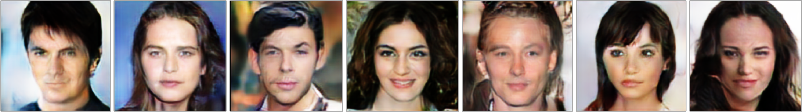
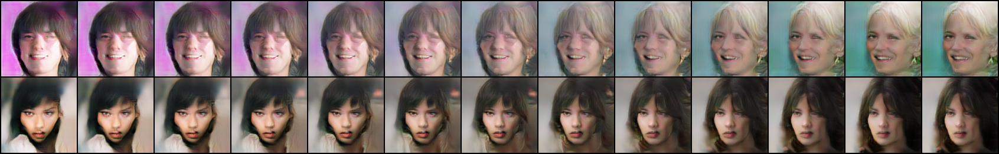
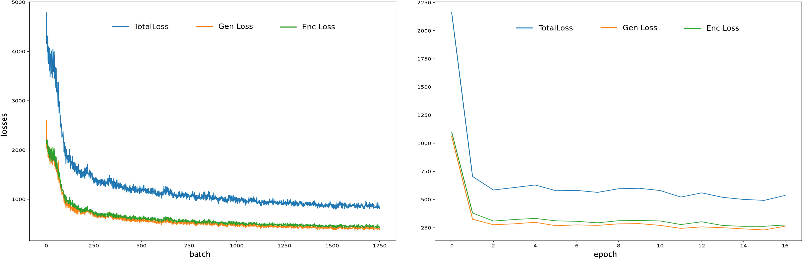

# DeepGenerativeModel

This project re‐implement the introspective variational autoencoder to synthesize realistic images. IntroVAE repurposes the inference model to additionally act as a discriminator, enabling the model to self‐estimate differences between generated and real images in an adversarial manner. We replicate and deliver comparable image quality to those presented in the research, and confirm the advantages of this model over standard VAEs and GANs.

1. Image reconstruction

	

2. Sample from model

	

3. Interpolations

	

	
4. Loss

	

